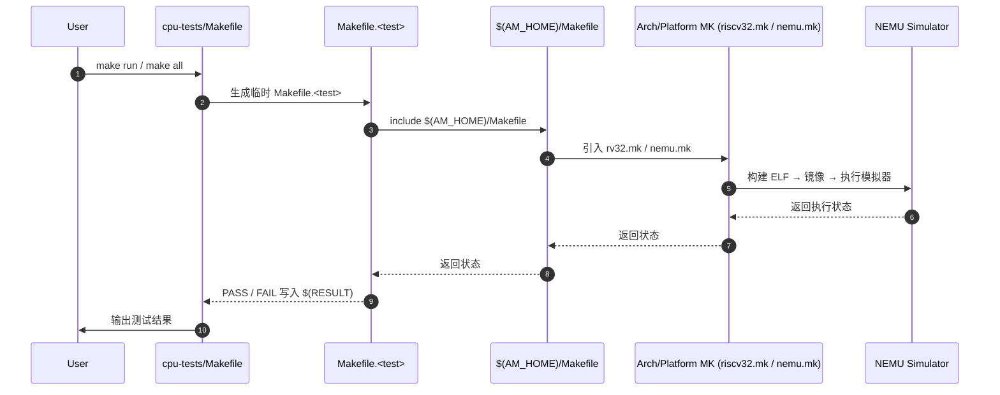
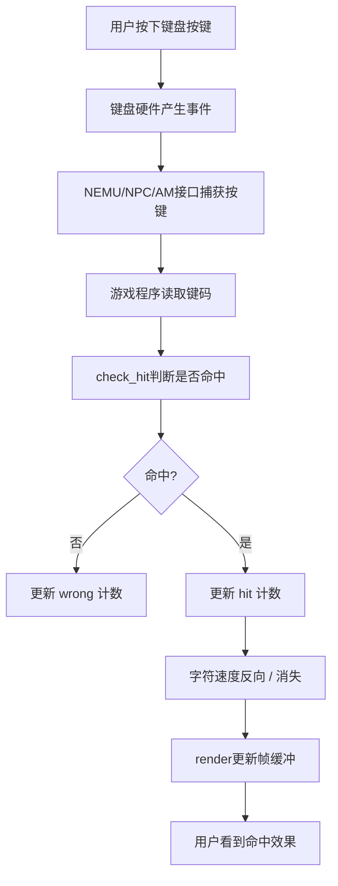

## D阶段

### D1 支持RV32IM的NEMU

#### NJU PA2.1: 实现更多的指令, 在NEMU中运行大部分cpu-tests

> 类似 minirvEMU

1. Macro expansion
NEMU makefile add preprocess target to generate preprocessed source files, facilitating source code debugging and analysis (macro expansion).
```makefile
PREPS = $(SRCS:%.c=$(OBJ_DIR)/%.i) $(CXXSRC:%.cc=$(OBJ_DIR)/%.i)
$(OBJ_DIR)/%.i: %.c
	@echo + CPP $<
	@mkdir -p $(dir $@)
	@$(CC) $(CFLAGS) -E -dD $< -o $@
$(OBJ_DIR)/%.i: %.cc
	@echo + CPP $<
	@mkdir -p $(dir $@)
	@$(CXX) $(CFLAGS) $(CXXFLAGS) -E -dD $< -o $@
.PHONY: preprocess
preprocess: $(PREPS)
```

2. mips32的分支延迟槽
为了提升处理器的性能, mips使用了一种叫分支延迟槽的技术. 采用这种技术之后, 程序的执行顺序会发生一些改变: 我们把紧跟在跳转指令(包括有条件和无条件)之后的静态指令称为延迟槽, 那么程序在执行完跳转指令后, 会先执行延迟槽中的指令, 再执行位于跳转目标的指令.

### D2 程序的机器级表示

1. 程序的内存布局
  +----------+
  |          |
  +----------+
  |   stack  |
  +----------+
  |    |     |  // 与变量相关的三个内存区域: 静态数据区(data), 堆区(heap), 栈区(stack)
  |    v     |  // 静态 = 不动态增长和变化, 编译时确定
  |          |  // 四种需要分配的C变量
  |    ^     |  // 全局变量 → data区
  |    |     |  // 静态局部变量 → data区
  +----------+  // 非静态局部变量 → stack区
  |   heap   |  // 动态变量 → heap区
  +----------+
  |   data   |
  +----------+
  |   text   |
  +----------+
  |          |
  +----------+

### D3 AM运行时环境

#### NJU PA2: 程序, 运行时环境与AM

1. AM(Abstract machine)项目就是这样诞生的. 作为一个向程序提供运行时环境的库, AM根据程序的需求把库划分成以下模块

AM = TRM + IOE + CTE + VME + MPE
TRM(Turing Machine) - 图灵机, 最简单的运行时环境, 为程序提供基本的计算能力
IOE(I/O Extension) - 输入输出扩展, 为程序提供输出输入的能力
CTE(Context Extension) - 上下文扩展, 为程序提供上下文管理的能力
VME(Virtual Memory Extension) - 虚存扩展, 为程序提供虚存管理的能力
MPE(Multi-Processor Extension) - 多处理器扩展, 为程序提供多处理器通信的能力 (MPE超出了ICS课程的范围, 在PA中不会涉及)

2. stdarg.h
<stdarg.h> 是 C 标准库中的一个头文件，提供了一组宏，用于访问可变数量的参数。
stdarg.h 头文件定义了一个变量类型 va_list 和三个宏，这三个宏可用于在参数个数未知（即参数个数可变）时获取函数中的参数。可变参数的函数通在参数列表的末尾是使用省略号 ... 定义的。

```c
#include <stdio.h>
#include <stdarg.h>
// 计算可变参数的和
int sum(int count, ...) {
  int total = 0;
  va_list args;
  // 初始化 args 以访问可变参数
  va_start(args, count);
  // 逐个访问可变参数
  for (int i = 0; i < count; i++)
    total += va_arg(args, int);
  // 清理 args
  va_end(args);
  return total;
}
int main() {
  printf("Sum of 1, 2, 3: %d\n", sum(3, 1, 2, 3));  // 输出 6
  printf("Sum of 4, 5, 6, 7: %d\n", sum(4, 4, 5, 6, 7));  // 输出 22
  return 0;
}
```

### D4 用RTL实现迷你RISC-V处理器

### D5 设备和输入输出

#### NJU PA2.3

1. volatile 关键字
volatile关键字的作用十分特别, 它的作用是避免编译器对相应代码进行优化.`volatile` 主要用于 **硬件 / OS / 并发编程**. 典型场景：
    1.1 硬件寄存器
    ```c
    volatile uint32_t *uart = (void*)0x10000000;
    ```
    1.2 中断共享变量
    ```c
    volatile int flag;  // 中断处理程序会修改 `flag`
    while(flag == 0);
    ```

举例:
写寄存器. 假设：UART发送多个字符
```
volatile char *p = UART寄存器;
*p = 0x33;
*p = 0x34;
*p = 0x86;
```

如果被编译器优化成：(编译器认为前两次写入没效果). 设备行为就 **完全错误**。
```
*p = 0x86
```


读取寄存器也是一样. 假设：
```
while(*status != READY);
```
设备会在未来某个时刻把寄存器改成 READY。如果没有 `volatile`： 编译器认为： `status 没被修改`. 于是：
```
while(1)
```
程序 **永远读不到 READY**。

> `volatile` 的本质是：
> 告诉编译器：
> **这个内存可能被程序之外的东西改变（硬件 / 中断 / DMA）**
> **禁止优化访问**
> 否则编译器会： * 缓存值 * 删除读 * 删除写 * 合并写. 导致 **设备驱动错误**。

2. 输入输出 abstract-machine

```c
#define io_read(reg) \
  ({ reg##_T __io_param; \
     ioe_read(reg, &__io_param); \
     __io_param; })
#define io_write(reg, ...) \
  ({ reg##_T __io_param = (reg##_T) { __VA_ARGS__ }; \
     ioe_write(reg, &__io_param); })
```

`__VA_ARGS__` 是 C 语言宏中的可变参数占位符。意思是：宏定义时，你可以写不定数量的参数，这些参数在宏展开时会替换 `__VA_ARGS__`。

将函数展开：
```c
uint64_t t = io_read(AM_TIMER_UPTIME).us;
uint64_t t = ({ AM_TIMER_UPTIME_T __io_param; ioe_read(AM_TIMER_UPTIME, &__io_param); __io_param; }).us;
io_write(AM_GPU_FBDRAW, x[i], y[i], blank, CHAR_W, CHAR_H, false);
({ AM_GPU_FBDRAW_T __io_param = (AM_GPU_FBDRAW_T) { x[i], y[i], blank, 8, 16, 0 }; ioe_write(AM_GPU_FBDRAW, &__io_param); });
```

3. 优化LiteNES
TODO:

4. 在NEMU上运行NEMU
进行如下的工作:
  1. 保存NEMU当前的配置选项
  2. 加载一个新的配置文件, 将NEMU编译到AM上, 并把mainargs指示bin文件作为这个NEMU的镜像文件
  3. 恢复第1步中保存的配置选项
  4. 重新编译NEMU, 并把第2步中的NEMU作为镜像文件来运行

> 把NEMU编译到AM时, 配置系统会定义宏CONFIG_TARGET_AM, 此时NEMU的行为和之前相比有所变化:
> sdb, DiffTest等调试功能不再开启, 因为AM无法提供它所需要的库函数(如文件读写, 动态链接, 正则表达式等)
> 通过AM IOE来实现NEMU的设备

把这一层层“套娃”理顺，其实就是一条 **IO 请求逐层向外传递** 的路径。系统看起来像三层机器：
1. **最外层：主机上的 NEMU（Outer NEMU）**
2. **中间层：运行在 AM 上的 NEMU（Inner NEMU）**
3. **最内层：打字游戏程序**
关键点：**真正的键盘和屏幕只有最外层主机有**。里面所有程序看到的设备，都是逐层模拟出来的。

把完整链条画出来会非常清楚：
打字游戏 (AM IOE) → 内层NEMU里的设备 (MMIO) → 内层NEMU CPU模拟 → 外层NEMU设备模拟 → SDL / 主机硬件 → 真实键盘 / 屏幕


4. 实验报告
4.1 程序是个状态机 理解YEMU的执行过程
exec_once → IF → ID → EX → PC+1 
→ whether halt: yes → return
                 no → exec_once
4.2 RTFSC 请整理一条指令在NEMU中的执行过程
isa_exec_once → inst_fetch → decode_exec → INSTPAT_MATCH → exce
4.3 程序如何运行 理解打字小游戏如何运行
init(ioe,gpu) → while(1) 主循环
→ 计时 (AM_TIMER_UPTIME)
→ game_logic_update() 更新字符状态
→ 读取键盘 (AM_INPUT_KEYBRD)
→ check_hit() 判断是否击中
→ render() 绘制屏幕
→ 循环执行，形成 30 FPS 的打字下落游戏。
4.4 编译与链接 (ifetch.h)
定义在头文件中的函数实现，而不是声明，所以编译行为会比较特殊。
1. 去掉 static 保留 inline
> 编译正确
2. 去掉 inline 保留 static
> 编译正确
3. 去掉 static & inline
> multiple definition of `inst_fetch'

inst_fetch() 定义在头文件中，因此会被多个 .c 文件包含。如果既不使用 static 也不使用 inline，每个编译单元都会生成一个全局符号 inst_fetch，在链接阶段产生 multiple definition 错误。
如果只保留 static，函数具有 internal linkage，每个目标文件拥有独立的 inst_fetch，因此不会发生符号冲突。
如果只保留 inline，根据 C99 标准需要在某个源文件中提供一个外部定义，否则可能产生 undefined reference。但在 GCC 默认的 gnu89/gnu11 模式下，inline 函数通常会生成 weak symbol，因此多个目标文件中的定义不会冲突，所以仍然能够成功链接。
使用 static inline 是头文件函数的常见写法，可以同时获得内联优化并避免符号冲突。

4.5 编译与链接
```nm build/riscv32-nemu-interpreter | grep dummy | wc -l```
1. 添加 `volatile static int dummy;`
> common.h -> 36
> debug.h -> redefinition of ‘volatile int dummy’
3. 添加 `volatile static int dummy = 0;`
> common.h -> 36
> debug.h -> redefinition of ‘volatile int dummy’

NEMU 中有多少个 dummy 实体： 等于包含 common.h/debug.h 的 .c 文件数量。

4.6 了解Makefile
`am-kernels/kernels/hello`敲入`make ARCH=$ISA-nemu`后:
1. 设置项目名称，编译文件添加当前项目中的"hello.c"，调用`$(AM_HOME)/Makefile`
2. $(AM_HOME)/Makefile:
  Basic Setup and Checks
  根据架构和平台，引入相关makefile，同时引入相关需要编译的文件
  编译项目
  使用"insert-arg.py"脚本将mainarg嵌入程序中

---

## C阶段
### C1 工具和基础设施

1.. 什么才算是一个 Symbol？

在 **ELF 符号表**中，一个 **symbol** 一般指： **在链接阶段需要被识别或解析的名字**. 也就是说： 一个 symbol 必须满足：
1️⃣ **有全局或静态存储位置**
2️⃣ **在链接时可能被引用**

典型的 symbol 包括： (1) 全局变量 (2) 函数 (3) static 全局变量 (4) 外部引用

2. 寻找"Hello World!"
"Hello World!" 不在 ELF 的字符串表 .strtab 或 .dynstr 中，而是在 .rodata 段。
```c
#include <stdio.h>
int main() {
    printf("Hello World!\n");
    return 0;
}
```
```bash
gcc hello.c -o hello
readelf -x .rodata hello
```

### C2 支持RV32E的单周期NPC
### C3 调试技巧
### C4 ELF文件和链接
### C5 异常处理和RT-Thread

### C阶段答辩

1. Makefile 调用时序图

`cpu-tests/Makefile`


2. Typing-Game 程序流程图


%% 程序视角：事件处理到渲染
init(ioe,gpu) → while(1) 主循环
  → 计时 (AM_TIMER_UPTIME)
  → game_logic_update() 更新字符状态
  → 读取键盘 (AM_INPUT_KEYBRD)
  → check_hit() 判断是否击中
  → render() 绘制屏幕
  → 循环执行，形成 30 FPS 的打字下落游戏。

