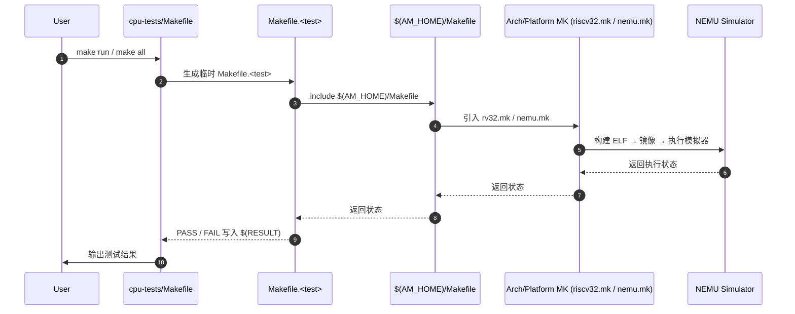
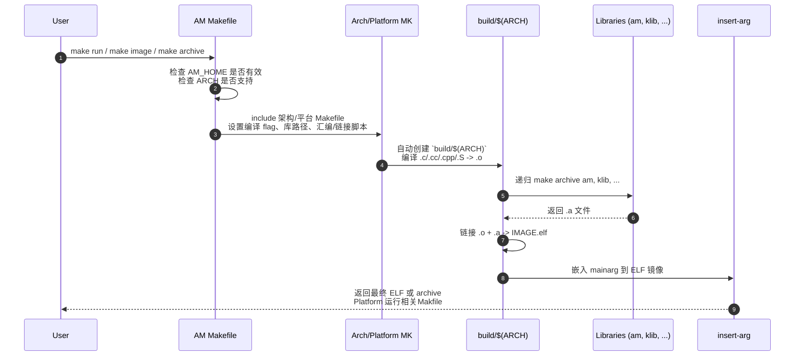
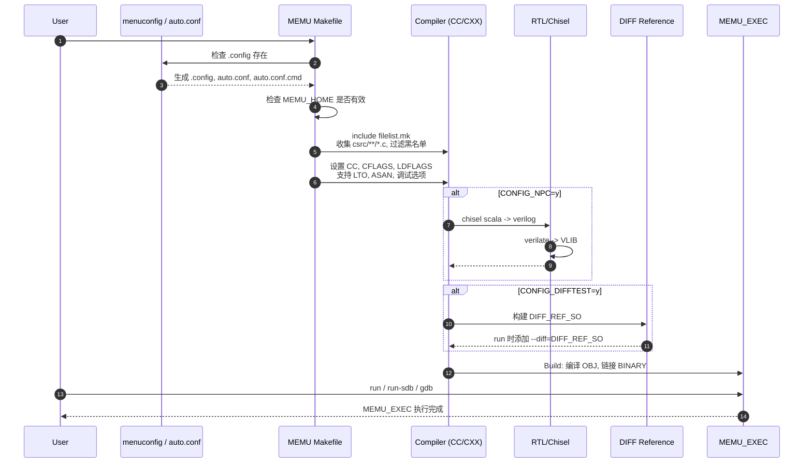

## F阶段
### F1 如何科学地提问
### F2 Logisim安装和使用
### F3 数字逻辑电路基础
### F4 计算机系统的状态机模型
### F5 支持数列求和的简单处理器
### F6 功能完备的迷你RISC-V处理器


## E阶段
### E1 C语言程序设计
### E2 硬件描述语言
### E3 Linux系统安装和基本使用
### E4.1 从C代码到二进制程序
### E4.2 C程序的执行
### E4.3 指令集模拟器
### E5.1 RTL代码的仿真
### E5.2 逻辑综合

1. 尝试使用综合器
    make syn error: `/bin/bash: line 1: yosys: command not found`
    >  查看 OSCPU/yosys-sta README. 安装yosys

`test/yosys` 文件夹中:
```bash
yosys alu.v
```
```yosys
# Step1 细化(Elaboration)
# 细化阶段的工作包括解析模块间的实例化关系, /
# 计算模块实例的参数, 完成模块实例化的实例名和端口绑定等.
hierarchy -check -top alu
# 可视化
show

# Step2 粗粒度综合(Coarse-grain synthesis)
# 采用字级单元(word-level cells)来描述设计: 
# $add, $and, $or, $not, $mux, $mem, $dff, $latch, $sr ...
proc; opt; fsm; opt; memory; opt
# 可视化
show

# Step3 细粒度综合(Fine-grain synthesis)
techmap; opt
# 可视化
show

# Step4 写出中间网表
write_verilog alu.rtlil

# Step5 工艺映射(Technology mapping)
# 工艺映射是指从工艺无关的电路表示映射到具体工艺的实现.
dfflibmap -liberty cell.lib
read_liberty -lib cell.lib
# 可视化
show
abc -liberty cell.lib
# 可视化
show

# Step6 网表和报告生成
write_verilog alu.netlist
stat -liberty cell.lib

```

### E5.3 Verilog的RTL综合语义
### E5.4 标准单元库
### E5.5 物理设计

## D阶段

### D1 支持RV32IM的NEMU

#### NJU PA2.1: 实现更多的指令, 在NEMU中运行大部分cpu-tests

> 类似 minirvEMU

1. Macro expansion
NEMU makefile add preprocess target to generate preprocessed source files, facilitating source code debugging and analysis (macro expansion).
```makefile
PREPS = $(SRCS:%.c=$(OBJ_DIR)/%.i) $(CXXSRC:%.cc=$(OBJ_DIR)/%.i)
$(OBJ_DIR)/%.i: %.c
	@echo + CPP $<
	@mkdir -p $(dir $@)
	@$(CC) $(CFLAGS) -E -dD $< -o $@
$(OBJ_DIR)/%.i: %.cc
	@echo + CPP $<
	@mkdir -p $(dir $@)
	@$(CXX) $(CFLAGS) $(CXXFLAGS) -E -dD $< -o $@
.PHONY: preprocess
preprocess: $(PREPS)
```

2. mips32的分支延迟槽
为了提升处理器的性能, mips使用了一种叫分支延迟槽的技术. 采用这种技术之后, 程序的执行顺序会发生一些改变: 我们把紧跟在跳转指令(包括有条件和无条件)之后的静态指令称为延迟槽, 那么程序在执行完跳转指令后, 会先执行延迟槽中的指令, 再执行位于跳转目标的指令.

### D2 程序的机器级表示

1. 程序的内存布局
  +----------+
  |          |
  +----------+
  |   stack  |
  +----------+
  |    |     |  // 与变量相关的三个内存区域: 静态数据区(data), 堆区(heap), 栈区(stack)
  |    v     |  // 静态 = 不动态增长和变化, 编译时确定
  |          |  // 四种需要分配的C变量
  |    ^     |  // 全局变量 → data区
  |    |     |  // 静态局部变量 → data区
  +----------+  // 非静态局部变量 → stack区
  |   heap   |  // 动态变量 → heap区
  +----------+
  |   data   |
  +----------+
  |   text   |
  +----------+
  |          |
  +----------+

### D3 AM运行时环境

#### NJU PA2: 程序, 运行时环境与AM

1. AM(Abstract machine)项目就是这样诞生的. 作为一个向程序提供运行时环境的库, AM根据程序的需求把库划分成以下模块

AM = TRM + IOE + CTE + VME + MPE
TRM(Turing Machine) - 图灵机, 最简单的运行时环境, 为程序提供基本的计算能力
IOE(I/O Extension) - 输入输出扩展, 为程序提供输出输入的能力
CTE(Context Extension) - 上下文扩展, 为程序提供上下文管理的能力
VME(Virtual Memory Extension) - 虚存扩展, 为程序提供虚存管理的能力
MPE(Multi-Processor Extension) - 多处理器扩展, 为程序提供多处理器通信的能力 (MPE超出了ICS课程的范围, 在PA中不会涉及)

2. stdarg.h
<stdarg.h> 是 C 标准库中的一个头文件，提供了一组宏，用于访问可变数量的参数。
stdarg.h 头文件定义了一个变量类型 va_list 和三个宏，这三个宏可用于在参数个数未知（即参数个数可变）时获取函数中的参数。可变参数的函数通在参数列表的末尾是使用省略号 ... 定义的。

```c
#include <stdio.h>
#include <stdarg.h>
// 计算可变参数的和
int sum(int count, ...) {
  int total = 0;
  va_list args;
  // 初始化 args 以访问可变参数
  va_start(args, count);
  // 逐个访问可变参数
  for (int i = 0; i < count; i++)
    total += va_arg(args, int);
  // 清理 args
  va_end(args);
  return total;
}
int main() {
  printf("Sum of 1, 2, 3: %d\n", sum(3, 1, 2, 3));  // 输出 6
  printf("Sum of 4, 5, 6, 7: %d\n", sum(4, 4, 5, 6, 7));  // 输出 22
  return 0;
}
```

### D4 用RTL实现迷你RISC-V处理器

### D5 设备和输入输出

#### NJU PA2.3

1. volatile 关键字
volatile关键字的作用十分特别, 它的作用是避免编译器对相应代码进行优化.`volatile` 主要用于 **硬件 / OS / 并发编程**. 典型场景：
    1.1 硬件寄存器
    ```c
    volatile uint32_t *uart = (void*)0x10000000;
    ```
    1.2 中断共享变量
    ```c
    volatile int flag;  // 中断处理程序会修改 `flag`
    while(flag == 0);
    ```

举例:
写寄存器. 假设：UART发送多个字符
```
volatile char *p = UART寄存器;
*p = 0x33;
*p = 0x34;
*p = 0x86;
```

如果被编译器优化成：(编译器认为前两次写入没效果). 设备行为就 **完全错误**。
```
*p = 0x86
```


读取寄存器也是一样. 假设：
```
while(*status != READY);
```
设备会在未来某个时刻把寄存器改成 READY。如果没有 `volatile`： 编译器认为： `status 没被修改`. 于是：
```
while(1)
```
程序 **永远读不到 READY**。

> `volatile` 的本质是：
> 告诉编译器：
> **这个内存可能被程序之外的东西改变（硬件 / 中断 / DMA）**
> **禁止优化访问**
> 否则编译器会： * 缓存值 * 删除读 * 删除写 * 合并写. 导致 **设备驱动错误**。

2. 输入输出 abstract-machine

```c
#define io_read(reg) \
  ({ reg##_T __io_param; \
     ioe_read(reg, &__io_param); \
     __io_param; })
#define io_write(reg, ...) \
  ({ reg##_T __io_param = (reg##_T) { __VA_ARGS__ }; \
     ioe_write(reg, &__io_param); })
```

`__VA_ARGS__` 是 C 语言宏中的可变参数占位符。意思是：宏定义时，你可以写不定数量的参数，这些参数在宏展开时会替换 `__VA_ARGS__`。

将函数展开：
```c
uint64_t t = io_read(AM_TIMER_UPTIME).us;
uint64_t t = ({ AM_TIMER_UPTIME_T __io_param; ioe_read(AM_TIMER_UPTIME, &__io_param); __io_param; }).us;
io_write(AM_GPU_FBDRAW, x[i], y[i], blank, CHAR_W, CHAR_H, false);
({ AM_GPU_FBDRAW_T __io_param = (AM_GPU_FBDRAW_T) { x[i], y[i], blank, 8, 16, 0 }; ioe_write(AM_GPU_FBDRAW, &__io_param); });
```

3. 优化LiteNES
TODO:

4. 在NEMU上运行NEMU
进行如下的工作:
  1. 保存NEMU当前的配置选项
  2. 加载一个新的配置文件, 将NEMU编译到AM上, 并把mainargs指示bin文件作为这个NEMU的镜像文件
  3. 恢复第1步中保存的配置选项
  4. 重新编译NEMU, 并把第2步中的NEMU作为镜像文件来运行

> 把NEMU编译到AM时, 配置系统会定义宏CONFIG_TARGET_AM, 此时NEMU的行为和之前相比有所变化:
> sdb, DiffTest等调试功能不再开启, 因为AM无法提供它所需要的库函数(如文件读写, 动态链接, 正则表达式等)
> 通过AM IOE来实现NEMU的设备

把这一层层“套娃”理顺，其实就是一条 **IO 请求逐层向外传递** 的路径。系统看起来像三层机器：
1. **最外层：主机上的 NEMU（Outer NEMU）**
2. **中间层：运行在 AM 上的 NEMU（Inner NEMU）**
3. **最内层：打字游戏程序**
关键点：**真正的键盘和屏幕只有最外层主机有**。里面所有程序看到的设备，都是逐层模拟出来的。

把完整链条画出来会非常清楚：
打字游戏 (AM IOE) → 内层NEMU里的设备 (MMIO) → 内层NEMU CPU模拟 → 外层NEMU设备模拟 → SDL / 主机硬件 → 真实键盘 / 屏幕


4. 实验报告
4.1 程序是个状态机 理解YEMU的执行过程
exec_once → IF → ID → EX → PC+1
→ whether halt: yes → return
                 no → exec_once
4.2 RTFSC 请整理一条指令在NEMU中的执行过程
isa_exec_once → inst_fetch → decode_exec → INSTPAT_MATCH → exce
4.3 程序如何运行 理解打字小游戏如何运行
init(ioe,gpu) → while(1) 主循环
→ 计时 (AM_TIMER_UPTIME)
→ game_logic_update() 更新字符状态
→ 读取键盘 (AM_INPUT_KEYBRD)
→ check_hit() 判断是否击中
→ render() 绘制屏幕
→ 循环执行，形成 30 FPS 的打字下落游戏。
4.4 编译与链接 (ifetch.h)
定义在头文件中的函数实现，而不是声明，所以编译行为会比较特殊。
1. 去掉 static 保留 inline
> 编译正确
2. 去掉 inline 保留 static
> 编译正确
3. 去掉 static & inline
> multiple definition of `inst_fetch'

inst_fetch() 定义在头文件中，因此会被多个 .c 文件包含。如果既不使用 static 也不使用 inline，每个编译单元都会生成一个全局符号 inst_fetch，在链接阶段产生 multiple definition 错误。
如果只保留 static，函数具有 internal linkage，每个目标文件拥有独立的 inst_fetch，因此不会发生符号冲突。
如果只保留 inline，根据 C99 标准需要在某个源文件中提供一个外部定义，否则可能产生 undefined reference。但在 GCC 默认的 gnu89/gnu11 模式下，inline 函数通常会生成 weak symbol，因此多个目标文件中的定义不会冲突，所以仍然能够成功链接。
使用 static inline 是头文件函数的常见写法，可以同时获得内联优化并避免符号冲突。

4.5 编译与链接
```nm build/riscv32-nemu-interpreter | grep dummy | wc -l```
1. 添加 `volatile static int dummy;`
> common.h -> 36
> debug.h -> redefinition of ‘volatile int dummy’
3. 添加 `volatile static int dummy = 0;`
> common.h -> 36
> debug.h -> redefinition of ‘volatile int dummy’

NEMU 中有多少个 dummy 实体： 等于包含 common.h/debug.h 的 .c 文件数量。

4.6 了解Makefile
`am-kernels/kernels/hello`敲入`make ARCH=$ISA-nemu`后:
1. 设置项目名称，编译文件添加当前项目中的"hello.c"，调用`$(AM_HOME)/Makefile`
2. $(AM_HOME)/Makefile:
  Basic Setup and Checks
  根据架构和平台，引入相关makefile，同时引入相关需要编译的文件
  编译项目
  使用"insert-arg.py"脚本将mainarg嵌入程序中

---

## C阶段
### C1 工具和基础设施

1.. 什么才算是一个 Symbol？

在 **ELF 符号表**中，一个 **symbol** 一般指： **在链接阶段需要被识别或解析的名字**. 也就是说： 一个 symbol 必须满足：
1.1 **有全局或静态存储位置**
1.2 **在链接时可能被引用**
典型的 symbol 包括： (1) 全局变量 (2) 函数 (3) static 全局变量 (4) 外部引用

2. 寻找"Hello World!"

    "Hello World!" 不在 ELF 的字符串表 .strtab 或 .dynstr 中，而是在 .rodata 段。
    ```c
    #include <stdio.h>
    int main() {
        printf("Hello World!\n");
        return 0;
    }
    ```
    ```bash
    gcc hello.c -o hello
    readelf -x .rodata hello
    ```

3. ELF 文件结构

ELF - Executable and Linkable Format
我们先写一段极简的 C 代码，来论证 ELF 是如何将不同数据分类存放的。
```c
// main.c
#include <stdio.h>
int global_init = 42;  // 已初始化，应在 .data
int global_uninit[10000];  // 未初始化数组（占据约 40KB），应在 .bss
const char* msg = "Hello ELF";  // 字符串常量，应在 .rodata
int main() {
  printf("%s\n", msg);  // 代码逻辑，应在 .text
  return 0;
}
```
编译它：gcc main.c -o app

3.1. 链接视图：Section（给编译器和链接器看）
使用 readelf -S app 查看 Section 头部表，你会清晰地看到刚才代码中的元素被安排得明明白白：

.text（代码段）：存放 main 函数的机器指令。权限是只读且可执行。
.data（数据段）：存放 global_init（值为 42）。权限是可读可写。
.rodata（只读数据段）：存放 "Hello ELF"。权限是只读。
.bss（BSS段）：存放 global_uninit。
🎯 重点实证：如果你用 ls -l app 查看文件大小，可能只有 16KB。但 global_uninit 数组明明需要 40KB 的空间！这是因为 .bss 段在 ELF 文件中不占实际的磁盘空间，ELF 只记录了一句：“这里需要 40KB 的内存”。等程序运行加载到内存时，操作系统才会分配这 40KB 并清零。

3.2. 执行视图：Segment（给操作系统加载器看）
操作系统在运行程序时，嫌弃一个个细碎的 Section 效率太低，它只关心内存权限。使用 readelf -l app 查看 Segment（Program Headers）：
你会看到两个主要的 LOAD 段：
第一个 LOAD 段（只读/可执行 R E）：操作系统将 .text 和 .rodata 打包进这个内存页。如果程序企图修改这片内存，会直接触发 Segmentation Fault（段错误）。
第二个 LOAD 段（可读/可写 R W）：操作系统将 .data 和 .bss 打包进这个内存页。

3.3 ELF vs BIN
ELF 文件和 BIN 文件是两种完全不同类型的文件，它们的用途和结构差异很大。下面做一个详细对比：

- 3.3.1. 文件定义
  * **ELF（Executable and Linkable Format）文件**
    * 是一种可执行文件格式，常用于 Linux、Unix 系统。
    * 可以包含 **程序代码、数据、符号表、调试信息** 等。
    * 可以直接被操作系统加载执行，或用于链接生成最终可执行程序。
    * 有不同类型：可执行文件（`ET_EXEC`）、共享库（`ET_DYN`）、目标文件（`ET_REL`）等。
  * **BIN 文件**
    * 通常指 **纯二进制文件**，没有任何头信息或元数据。
    * 直接包含机器码或者原始数据，系统无法直接识别结构。
    * 常用于嵌入式系统的固件烧写、裸机程序等。

- 3.3.2. 文件结构

  | 特性         | ELF 文件                           | BIN 文件             |
  | ---------- | -------------------------------- | ------------------ |
  | 头信息        | 有 ELF header，包括程序入口、段表、节表等       | 没有头信息              |
  | 段（Segment） | 包含多个段，如 `.text`, `.data`, `.bss` | 通常是一个连续的内存映像       |
  | 符号信息       | 可以包含符号表、调试信息                     | 通常没有符号信息           |
  | 可执行性       | 可以直接在操作系统中加载                     | 不能直接执行，需要特定地址/方式加载 |
  | 可移植性       | 依赖操作系统和 CPU 架构                   | 完全依赖硬件架构，纯码        |

- 3.3.3. 使用场景
  * **ELF 文件**
    * Linux 可执行程序（如 `gcc` 编译出的 `a.out`）
    * 动态链接库 (`.so`)
    * 调试与分析工具（可以使用 `objdump`、`readelf` 查看内部信息）
  * **BIN 文件**
    * MCU/FPGA/嵌入式裸机程序烧写
    * Bootloader、固件更新
    * 需要直接加载到内存执行的场景

- 3.3.4. 转换
  通常在嵌入式开发中会把 ELF 文件转成 BIN 文件：
  ```bash
  # 使用 objcopy
  arm-none-eabi-objcopy -O binary input.elf output.bin
  ```
  * ELF → BIN：丢掉符号表、节信息，只保留机器码和初始化数据。
  * BIN → ELF：理论上不可逆，需要额外工具重建段和符号表。


### C2 支持RV32E的单周期NPC

1. NEMU 动态库
    nemu/src/cpu/difftest/ref.c -> `ref.c` 的核心逻辑： 把 NEMU 封装成一个“可被外部控制的参考模型”，供 NPC 做逐条对比。`ref.c` 只是把 NEMU 的内部状态暴露出来，变成一个可控的 golden model。

    > 提供的四个接口的本质:
    > **difftest_memcpy**: 同步内存（NPC ↔ NEMU）。
    > **difftest_regcpy**: 同步架构状态（整个 `CPU_state` 结构体）。
    > **difftest_exec(n)**: 让 NEMU 执行 n 条指令。
    > **difftest_init**: 初始化内存和 ISA 状态。

2. 硬件如何区分有符号数和无符号数?
    编写以下程序:
    ```c
    #include <stdint.h>
    int32_t fun1(int32_t a, int32_t b) { return a + b; }
    uint32_t fun2(uint32_t a, uint32_t b) { return a + b; }
    ```
    然后编译并查看反汇编代码:
    ```bash
    riscv64-linux-gnu-gcc -c -march=rv32g -mabi=ilp32 -O2 test.c
    riscv64-linux-gnu-objdump -d test.o
    ```
    结果:
    ```
    test.o:     file format elf32-littleriscv
    Disassembly of section .text:
    00000000 <fun1>:
      0:   00b50533                add     a0,a0,a1
      4:   00008067                ret
    00000008 <fun2>:
      8:   00b50533                add     a0,a0,a1
      c:   00008067                ret
    ```

    **结论：硬件本身不区分有符号数和无符号数。**
    在 RISC-V 中，`add` 指令执行的是 **模 2³² 的加法**，只对比特做运算，不关心类型。 因此：
    ```c
    int32_t  a + b
    uint32_t a + b
    ```
    生成的都是：
    ```
    add a0, a0, a1
    ```
    区别只存在于： 软件如何解释结果
    硬件有区别情况在：
    * 比较指令（`slt` vs `sltu`）
    * 右移指令（`sra` vs `srl`）
    类型是编译器概念，不是硬件概念。

3. 观察ALU的综合结果
- 3.1 简化版 ALU:
    ```verilog
    module alu #(parameter WIDTH = 4) (
      input  [WIDTH-1:0] a,
      input  [WIDTH-1:0] b,
      input  [2:0] op,
      output reg [WIDTH-1:0] y
    );
    wire [WIDTH-1:0] add_res = a + b;
    wire [WIDTH-1:0] sub_res = a - b;
    always @(*) begin
      case (op)
        3'b000: y = add_res;
        3'b001: y = sub_res;
        3'b010: y = a << b;
        3'b011: y = a >> b;
        3'b100: y = (a < b);
        default: y = 0;
      endcase
    end
    endmodule
    ```

- 3.2 使用 yosys 进行综合
    ```bash
    yosys alu.v
    yosys> hierarchy -check -top alu
    yosys> proc; opt; fsm; opt; memory; opt
    yosys> show
    ```

**问题 1**  “减法、比较是否会自动合并为同一个加法器？”
> 默认情况下，**不会自动合并为一个物理加法器**: 同时有 $add $sub
> Yosys 更偏向逻辑展开，而不是资源复用。

**问题 2**  "移位运算符 << 和 >> 被综合成什么电路？"
> 被综合为 **多级多路选择器（barrel shifter）**
> ```verilog
> a << b (2 bits)
> ```
> 会变成：
> ```
> if b[0] → shift 1 bit
> if b[1] → shift 2 bit
> ```
> 也就是： log2(N) 级 MUX 级联

>  **特别说明**
> * 常数移位(a << 2) → 直接 rewiring
> * 可变移位(a << b) → barrel shifter（多级MUX）

**问题 3** "从运算符直接综合是否有改进空间？"
> Yosys 是逻辑综合工具，不是高级算术优化器。它：
> * 不做 aggressive 资源共享
> * 不做高层算术结构合并
> * 不做算术单元调度

### C3 调试技巧
### C4 ELF文件和链接

1. ELF目标文件
ELF目标文件 = 节 + 元数据(节头) + …

ELF中一些常见的节
节	说明	|	节	说明
.text	代码	|	.bss	未初始化数据
.data	可写数据	|	.debug	调试信息
.rodata	只读数据	|	.line	行号信息
> .bss - Block Starting Symbol

2. 链接 = 符号解析 + 重定位
符号解析 = 将符号的引用和其定义建立关联
重定位 = 合并节 + 确定符号地址 + 在引用处填写地址

### C5 异常处理和RT-Thread

#### NJU PA3.1

https://blog.stevepaul.cc/course-lab/nju-ics-pa/pa3

1. 文件后缀名是.S，代表的是这个汇编代码是会被预处理的。通过下面的命令输出预处理后的结果:
```
gcc -E trap.S -o trap.s
```

2. 理解上下文结构体的前世今生
查看RISC-V手册就会知道这个a0通用寄存器就是用来放函数的第一个参数的。看看上面的汇编就会发现是mv a0, sp把参数给传给__am_irq_hendle这个函数了。为什么要传sp寄存器呢？由于我们把上下文从低地址到高地址相对于sp存的，所以sp实际上就是上下文结构体的首地址了，所以把它当作指针的值传过去也很合理吧。

这里面成员的赋值的位置，看看刚才的预处理后的结果就知道了，都是相对于sp的分别的一个偏移处。

这四部分的联系：

riscv.h指定了上下文结构体的定义，方便CTE去使用上下文。
trap.S负责异常发生后对之前的程序状态进行保存，然后调用__am_irq_handle进一步处理异常，然后再恢复之前的程序状态。
上面的讲义文字把这一切的大纲给阐明了。
实现的新指令让这些东西能在NEMU上作为一个个指令能执行得动。具体而言ecall让程序具有了跳到异常处理程序的能力，csrrw和csrrs使得可以读取、写入CSR，让保存、恢复CSR的状态成为可能。

3. 标准 RISC-V（RV32I / RV64I）
  在标准 RISC-V ABI（如 RV32I）中：
    - a0–a7 是参数寄存器
    - a7 约定用于存放 syscall number
    - ecall 时：
      - a7 = syscall 号
      - a0–a6 = 参数
      - 返回值放在 a0

4. 理解穿越时空的旅程
yield() → 在a7寄存器放入自陷的标志，并要求执行ecall指令→ NEMU根据之前设定的异常处理入口，让pc指到异常处理入口__am_asm_trap→ 保存通用寄存器和CSR到栈上→以刚才保存的上下文为参数，调用__am_irq_handle→ 根据上下文的信息识别事件类型，修改mepc，并调用注册好了的simple_trap→输出y→ 从栈上恢复CSR和通用寄存器→调用mret→NEMU根据mepc的实现，恢复pc到mepc→ 继续跑之前的程序。


### C阶段答辩

1. Typing-Game 程序流程图
%% 按键视角：从按键到命中
按下键盘 → 键盘硬件产生事件
→ NEMU/NPC/AM接口捕获按键
→ 游戏程序读取键码
→ check_hit判断是否命中
→ 命中?
→ 更新 wrong 计数 / 更新 hit 计数
→ render更新帧缓冲

%% 程序视角：事件处理到渲染
init(ioe,gpu) → while(1) 主循环
  → 计时 (AM_TIMER_UPTIME)
  → game_logic_update() 更新字符状态
  → 读取键盘 (AM_INPUT_KEYBRD)
  → check_hit() 判断是否击中
  → render() 绘制屏幕
  → 循环执行，形成 30 FPS 的打字下落游戏。

2. Makefile 调用时序图

`cpu-tests/Makefile`


- 2.1. **cpu-tests/Makefile** 是入口，生成每个测试的临时 Makefile
- 2.2. **临时 Makefile** 引入 **AM Makefile**
- 2.3. **AM Makefile** 根据 `ARCH` 分析并引入对应的 **ISA/Platform makefiles**
- 2.4. 平台 makefile（nemu.mk）负责生成 ELF、镜像并调用 NEMU 执行
- 2.5. 执行结果逐层返回，最终记录到 `$(RESULT)` 并输出


3. Abstract Machine Makefile 调用时序图


- 3.1. **入口**：用户执行 `make run`、`make image` 或 `make archive`。
- 3.2. **环境检查**：
  * 确认 `AM_HOME` 指向 Abstract-Machine 仓库。
  * 检查 `ARCH` 是否在支持列表。
  * 拆分 `ARCH` 得到 `ISA` 和 `PLATFORM`。
- 3.3. **架构/平台配置**：
  * 引入架构/平台特定 makefile（`x86_64-qemu.mk`、`riscv64-nemu.mk` 等）。
  * 配置架构相关 flag、编译器、库路径、汇编/链接脚本。
- 3.4. **编译**：
  * 自动创建 `build/$(ARCH)`。
  * `.c/.cc/.cpp/.S -> .o`。
- 3.4.1. **依赖库编译**：
  * 对 `am`、`klib` 等库执行递归 make archive。
  * 返回 `.a` 文件。
- 3.5. **链接 ELF**：
  * `.o` + `.a` → 最终 `IMAGE.elf`。
- 3.6. **insert-arg**:(前进到8)
  * 嵌入 `mainarg` 到 ELF 镜像。
- 3.7. **完成**：
  * 返回给用户最终 ELF 或 archive 文件。
  * Platform 运行相关Makfile

4. MEMU Makefile 调用时序图



- 4.0. **menuconfig**
  * menuconfig 生成配置文件 .config auto.conf auto.conf.cmd
- 4.1. **环境检查**：
  * 确保 `MEMU_HOME` 指向 MEMU 仓库
  * `.config` 文件必须存在，否则提示 `make menuconfig`
- 4.2. **源文件收集**：
  * `filelist.mk`: 包含 `csrc/**/*.c` ...
  * 过滤黑名单目录/文件
- 4.3. **编译器配置**：
  * 根据 menuconfig 设置 CC、CFLAGS、LDFLAGS
  * 支持 LTO、ASAN、调试选项
- 4.4. **项目编译**：
  * 遍历 am/klib 等库构建 `.a`
  * 与 OBJ 一起链接最终可执行文件
- 4.4.1. **RTL/Chisel 支持**：
  * 如果配置 NPC（用 RTL CPU），生成 Verilog
  * 使用 Verilator 生成 VLIB
- 4.4.2. **差分测试（DIFFTEST）**：
  * 构建参考实现 SO 文件
  * run 时加 `--diff=DIFF_REF_SO` 参数
- 4.5. **最终执行**：
  * MEMU_EXEC 可以运行 batch 模式、SDB 调试模式或 gdb
